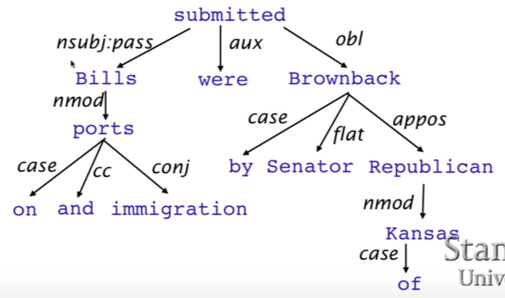

# cs224n

## NLP00

1. NLP level
   * speech: phonetic / phonological analysis
   * text: OCR / tokenization
   * morphological analysis
   * syntactic analysis
   * semantic interpretation
   * discourse processing
2. application
   * spell checking, keyword search, finding synonyms
   * extracting information from websites
   * machine translation
   * classifying, reading level of school texts, positive / negative sentiment of longer documents
   * spoken dialog system
   * complex question answering
   * online advertisement matching
   * sentiment analysis for marketing or finance / trading
   * speech recognition
   * chatbots / dialog agents
   * automating customer support
   * controlling devices
   * ordering goods
3. human language
   * discrete / symbolic / categorical signaling system
4. deep NLP
   * speech, words, syntax, semantics
   * parts-of-speech, entities, parsing
5. locallist representation: no inherent similarity
6. distributional similarity based representation
7. distributed representation
8. skip grams: predict context words given target (position independent)
   * center word vector
   * context word vector
9. continuous bag of words (CBOW): predict target word from bag-of-words context
10. hierarchical softmax
11. negative sampling
12. latent semantic analysis
13. window based co-occurrence matrix: less robust
    * increase in size with vocabulary
    * very high dimensional
    * SVD
14. LSA, HAL, COALS, Hellinger-PCA: fast training, efficient uage of statistics
15. skip-gram / CBOW, NNLM, HLBL, RNN: scale with corpus size, inefficient useage of statistics, generate improved performance on other tasks, can capture complex patterns beyond word similarity
16. GloVe: fast training, scalable to huge corpora, good performance even with small corpus and small vectors
17. intrinsic evaluation: on a specific / intermediate subtask
    * word vector analoyies
    * best dimensions~300
    * window size of 8 around is good for Glove
18. extrinsic evaluation: on a real task
19. semantic relationship, syntactic relationship

## NLP04

1. window classification
2. max-margin objective function: $\max \left( \text{0,}1-s_{positive}+s_{negative} \right)$

## NLP06

1. linguistic structure: constituency structure, dependency strcture
2. 上下文无关语法 = constituency = phrase structure grammar = context-free grammars (CFGs): Chomsky hierarchy
3. dependency structure: show which words depend on (modify or are arguments of) which other words
   * eliminate ambiguity: ```scientists study whales from space```
   * in English, nesting relationship: ```the board (approved) [its acquisition] [for $27 a share] (at its monthly meeting)```
   * suit for building semantic representation
4. Catalan number
5. treebank
   * part-of-speech taggers
   * broad coverage
   * frequencies and distributional information
   * evaluation metrics
   * binary asymmetric relations
6. [universal dependency](http://universaldependencies.org/)
   * prepositions do not have any dependents
7. dependency: syntactic structure consisting of binary asymmetric relations between lexical items (arrow)
   * [lexical item](https://en.wikipedia.org/wiki/Lexical_item)
   * dependency type: subject, prepositional object, apposition,
   * equivalent to a restricted kind of context-free grammar with dependency types
   * arrow connect a head (governor, superior, regent) with a dependent (modifier, inferior, subordinate): ```head->dependent```
   * rule: universal dependency
   * tree: connected, acyclic, single-head
   * strongly lexicalized
   * fake ROOT
   * no order between dependents of a head: cannot recover sentence order
8. dependency conditioning preference
   * bilexical affinities: ```discussion->issues```
   * dependency distance: mostly with nearby words
   * dependencies rarely span intervening verbs or punctuation
   * valency of heads (number of dependent for a head)
   * whether arrows can cross: ```ABCD```, ```A->C, B->D```; if no crossing, then called nested structure (projective dependency tree; linear order)
   * English non-projective dependency example: ```I 'll give a talk tomorrom on NLP```, ```talk->NLP, give->tomorrow```
9. dependency parsing
   * dynamic programming
   * graph algorithm: Minimum Spanning Tree (MST)
   * constraint satisfaction: edges are eliminated that don't satisfy hard constraints
   * transition-based parsing = deterministic dependency parsing (greedy choice)
10. greedy transition based parsing
    * stack $\sigma$
    * buffer $\beta$
    * dependency arcs $A$
    * actions: shift, left arc, right arc, (typed arc)
    * MaltParser (Nivre and Hall 2005): no search, could do a beam search, linear time parsing
    * only build projective dependency tree; (walk around ways) postprocessor, extra transitions (SWAP transition, cf. bubble sort, graph-based MSTParser)
    * problem: sparse, incomplete, expensive computation(95% parsing time is feature computation)
11. evaluation of dependency parsing: GOLD (ground truth) and prediction
    * UAS measeure: untyped (unlabeled) dependency accuracy
    * LAS measure: labeled dependency accuracy
    * not suffer too much waterfall effects
12. a neural dependency parser (Chen and Manning 2014)
13. open source dependency parser
    * [SyntaxNet](https://github.com/tensorflow/models/tree/master/research/syntaxnet)



## NLP07 introduction to tensorflow

skip

## NLP08 RNN and language models

1. language models: computes a probability for a sequence of words
   * word ordering: ```P(the cat is small) > p(small the is cat)```
   * word choice: ```p(walking home after school) > p(waking house after school)```
2. Markov assumption: probability is usually conditioned on window of n previous words
3. vanishing gradient problem
   * initialize ```W``` to identity matrix and use ```relu```
4. exploding gradient problem: clip gradient
5. sequence modeling task
   * NER
   * entity level sentiment in context
   * opinionated expression: DSE (direct subjective expression), ESE (expressive subjective expression)
6. annotation ```BIO```
7. ```Bi-RNN```
8. ```deep-RNN```
9. MPQA1.2 corpus
   * 535 news articles
   * 11111 sentences
   * labeled with DSE, ESE

## NLP09 machine translation, LSTM, GRU

1. statistical machine translation systems
   * source language ```f```
   * target language ```e```
   * probabilistic formula: $arg\max _ep\left( e|f \right) =arg\max _ep\left( f|e \right) p\left( e \right)$
   * translation model ```p(f|e)``` on parallel corpus
   * language model ```p(e)``` trained on target only corpus
2. step
   * alignments: 'zero fertility' word; one-to-many / many-to-one / many-to-many alignment; reordering; many possible translation
3. MT with RNNs
   * decoder: previous hidden state, last hidden vector, previous predicted output word
4. WMT 2016 competition
5. tackling obstacle by predicting unseen words
   * pointer-sentinel model

## research highlight

1. a simple but tough-to-beat baseline for sentence embedding
   * recurrent neural networks / recursive neural networks / CNN
   * unsupervised method
   * weighted BOWs + remove some special direction
2. Linear Algebraic Structure of Word Senses, with Applications to Polysemy
3. Bag of Tricks for Efficient Text Classification: fastText
   * bag of words (n-grams)
   * on par with deep learning classifiers
   * training takes seconds
   * hierarchical softmax
   * learn vector representation of words in different languages (better than word2vec)

## research highlight NLP06

1. paper: improving distributional similarity with lessons learned from word embedding
2. word represention method
   * count-based distribution models: SVD, PPMI (positive pointwise mutual information)
   * NN-based models: skip-gram negative smapling, CBOW, GloVe
3. paper proposal: hyperparameters and system design choices more important not the embedding algorithms themselves

## research highlight NLP07 - visual dialog

1. related work
   * image captioning: show, attend and tell
   * visual-semantic alignments
   * visual summary
   * visual question and answering
2. contributions
   * new AI task: visual dialog
   * novel two-person chat data-collection protocol
   * new dataset
   * a family of neural encoder-decoder models for visual dialog

## research highlight NLP08

1. structured training for NN transition-based parsing (Weiss et al. 2015)
2. contribution
   * leverage unlabelled data - tri-training
   * hyperparameter search
   * final layer: structureed perceptron, beam search: greedy algorithm are unable to look beyond one step ahead or to recover from incorrect decisions
3. SyntaxNet: Andor et al. 2016: global normalization

## research highlight NLP09

1. towards better language modeling
2. improve
   * inputs: ```word->subword->char```
   * regularization / preprocessing
3. subword: morpheme encoding, byte-paring encoding (BPE)
4. char-level embedding
5. preprocessing
   * randomly replacing words in a sentence with other words or use bigram statistics to generate Kneser-Ney inspired replacement (Ziang Xie, et al. 2016)
